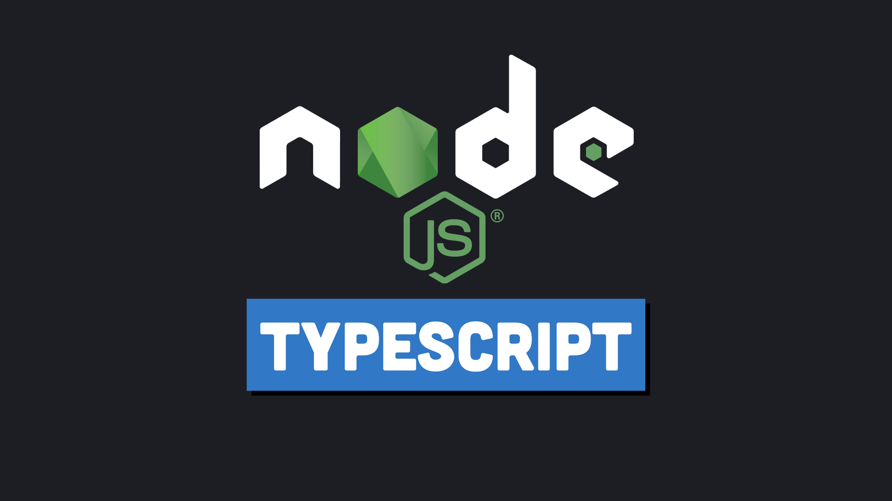

# Exploring the World of Node.js with TypeScript: A Comprehensive Series

Welcome to the comprehensive series on Node.js with TypeScript! This collection of tutorials covers a variety of topics, from fundamental concepts to advanced techniques. Whether you're a beginner or an experienced developer, this series aims to enhance your understanding of Node.js using TypeScript.

## Series Overview:

1. [**Series #01: File System Basics and Script Execution in Node.js TypeScript**](https://github.com/muneer-ahmed-khan/typescript-node-series/tree/master/series-01)
   - Explore the basics of the file system and learn how to pass additional arguments when running a script in Node.js TypeScript.

2. [**Series #02: The Synchronous Nature of the EventEmitter**](https://github.com/muneer-ahmed-khan/typescript-node-series/tree/master/series-02)
   - Delve into the synchronous nature of the EventEmitter in Node.js and understand its role in event-driven programming.

3. [**Series #03: Buffers Demystified**](https://github.com/muneer-ahmed-khan/typescript-node-series/tree/master/series-03)
   - Gain insights into Buffers, an essential component in handling binary data in Node.js.

4. [**Series #04: Understanding Readable Streams**](https://github.com/muneer-ahmed-khan/typescript-node-series/tree/master/series-04)
   - Dive into the world of Readable Streams and learn how to work with streams for efficient data processing.

5. [**Series #05: Mastering Writeable Streams**](https://github.com/muneer-ahmed-khan/typescript-node-series/tree/master/series-05)
   - Explore Writeable Streams and discover how to write data seamlessly using stream functionalities.

6. [**Series #06: Sending HTTP Requests in Node.js**](https://github.com/muneer-ahmed-khan/typescript-node-series/tree/master/series-06)
   - Learn the process of sending HTTP requests in Node.js and handling responses.

7. [**Series #07: Creating a Server and Receiving Requests**](https://github.com/muneer-ahmed-khan/typescript-node-series/tree/master/series-07)
   - Develop a server and grasp the essentials of receiving and handling requests.

8. [**Series #08: Implementing HTTPS with Your Own OPENSSL Certificate**](https://github.com/muneer-ahmed-khan/typescript-node-series/tree/master/series-08)
   - Secure your applications by implementing HTTPS with your custom OpenSSL certificate.

9. [**Series #09: Navigating the Event Loop in Node.js**](https://github.com/muneer-ahmed-khan/typescript-node-series/tree/master/series-09)
   - Gain a deeper understanding of the event loop in Node.js, a crucial aspect of its asynchronous nature.

10. [**Series #10: Creating a Child Process in Node.js**](https://github.com/muneer-ahmed-khan/typescript-node-series/tree/master/series-10)
    - Learn how to spawn child processes in Node.js for parallelizing tasks and improving system performance.

11. [**Series #11: Node.js Cluster: sharing the workload between multiple processes**](https://github.com/muneer-ahmed-khan/typescript-node-series/tree/master/series-11)
    - Improve application performance by parallelizing the execution of Node.js processes across multiple cores.

12. [**Series #12: Node.js HTTP/2 Protocol: use of http2 protocol with Node js**](https://github.com/muneer-ahmed-khan/typescript-node-series/tree/master/series-12)
    - usage of http/2 protocol

13. [**Series #13: Worker threads**](https://github.com/muneer-ahmed-khan/typescript-node-series/tree/master/series-13)
    - worker threads with message channel

14. [**Series #14: Measuring processes & worker threads with Performance hooks**](https://github.com/muneer-ahmed-khan/typescript-node-series/tree/master/series-14)
    - performance hooks
   
    

Feel free to explore each series at your own pace and level up your skills in Node.js and TypeScript. Happy coding! 🚀
